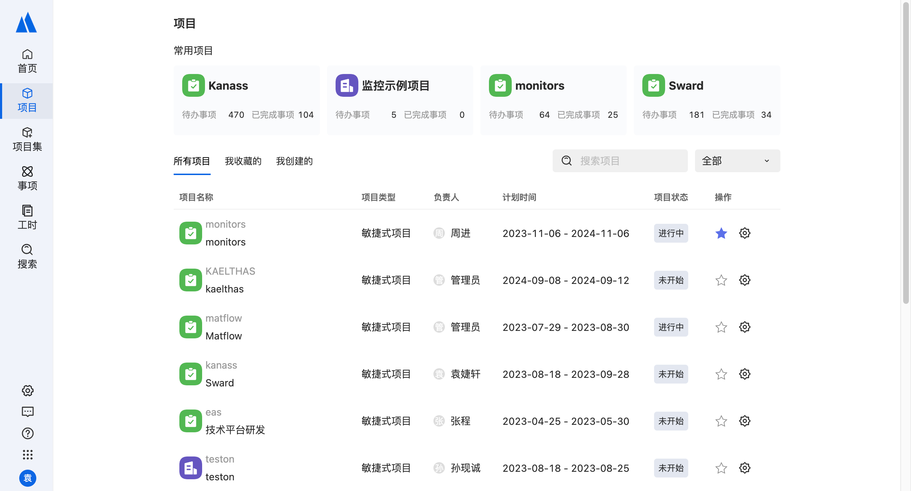

# 项目管理工具——kanass

<div align="center">

<!-- 


 -->


</div>
Kanass项目管理系统是专为项目管理而设计的应用软件，帮助项目管理者在有限的资源约束下，运用系统项目涉及的全部工作进行有效管理；本系统支持敏捷式项目管理与瀑布式项目管理两种模型；主要功能有项目管理，事项管理，工时管理，统计等

## 功能点

* 项目管理：以敏捷式和瀑布式跟踪管理项目
* 事项管理：支持表格，详情，甘特图，看板等多种视图查看，记录，管理项目产生的需求，任务，缺陷
* 统计：以图表形式展示事项发展趋势，或以各种属性统计事项数据
* 项目集管理：多个相关项目的协同管理，确保项目共同达到更高的业务目标

## 入门

#### 启动项目
```
1. git clone 
2. cd tiklab-kanass-ui
3. npm install
4. npm run start
```


#### 使用指南
点击查看[kanass使用文档](https://doc.tiklab.net/document/8d0d0cc33ccb)

## 更多功能
kanass作为一个项目管理系统，功能齐全，使用灵活；下面是一些常用功能
* 迭代管理
* 版本管理
* 权限管理
* 成员管理
* 消息管理
* 系统安全
* 自定义表单、流程、事项类型

## kanass 社区如何合作？
kanass社区主要通过问题、讨论和拉取请求在 GitHub 上进行交流。
* 问题：我们使用问题来跟踪错误和任务。任何与工作相关的事项都与问题相关。
* 讨论：我们利用讨论来提问、提出早期提案和发布公告。任何与想法相关的项目都与讨论相关。
* 拉取请求：我们使用拉取请求将来自贡献者的一组更改合并到 Kanass 中。

## 寻求帮助
如果你有以下疑问：
* 什么是 kanass？
* 如何使用 kanass？
* 为什么会出现意想不到的结果呢？
请在 [tiklab官网](https://community.tiklab.net/blog)开始讨论

但是如果你遇到以下几种情况：
* 你确定 kanass 有一个需要修复的 bug，
* 你认为某个功能可以改进，
* 您有一个详细的 kanass 改进建议，
请在github上打开一个问题

为了提出有效的问题，我们建议先阅读《[如何以聪明的方式提问](https://github.com/selfteaching/How-To-Ask-Questions-The-Smart-Way/blob/master/How-To-Ask-Questions-The-Smart-Way.md)》。

## 贡献
* 回答[讨论]()中提出的问题。
* 解决[问题]()中报告的错误并向我们发送拉取请求。
* 审查现有的拉取请求。
* 增强网站。我们通常需要：
    * 博客文章
    * 文档翻译
    * 用例展示企业系统中的 kanass 集成。
* 为生态系统中列出的项目做出贡献。
* 我们也欢迎上面未列出的任何其他形式的贡献。
<!-- * 如果您有兴趣做出贡献，请发送电子邮件至dev@tiklab.net告知我们！ -->

## 报告错误
请按照模板报告任何问题。

## 报告安全漏洞
请私下向我们报告安全漏洞。


## kanass 生态
* [kanass 网站](https://tiklab.net)- Tiklab kanass 官方网站
* [kanass 示例](https://demo.tiklab.net/kanass)-Tiklab kanass 官方网站
* [kanass 文档](https://doc.tiklab.net/document/8d0d0cc33ccb)- 使用文档

 ### 语言
 * js
 * react


