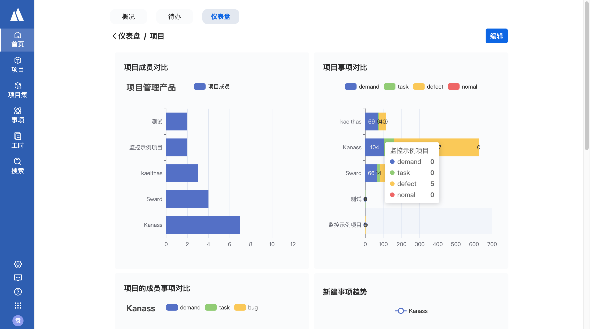

# 项目管理工具——kanass

Kanass项目管理系统是专为项目管理而设计的应用软件，帮助项目管理者在有限的资源约束下，运用系统项目涉及的全部工作进行有效管理；本系统支持敏捷式项目管理与瀑布式项目管理两种模型；主要功能有项目管理，事项管理，工时管理，统计等

# 1. Kanass 功能介绍
Kanass的主要功能有项目管理、事项管理、项目集管理、工时管理、统计分析等。
## 1.1 项目管理
Kanass支持两种项目模型，每个项目还拥有独立的成员权限管理，事项类型、表单与流程设置。
* 包括两种项目模型
   
    Kanass支持敏捷式开发与传统的瀑布式开发两种模型

* 支持多种事项类型
    
    每个项目内置需求、任务、缺陷三种基本的事项类型，还可以扩展自定义的事项类型

* 包含迭代、计划、版本等功能

    项目内包含迭代、计划、版本、里程碑等模块功能，还集成了sward知识库和TestHubo接口测试，便于使用文档和直接测试

* 含有统计分析功能
    
    项目内有事项统计、工时统计功能


* 内置成员权限
    
    每个项目拥有独立的成员与权限管理模块，只用于当前项目；

    项目列表：

    

## 1.2 事项管理
事项有需求、任务、缺陷三种基本事项类型，列表，详情，甘特图，看板4种视图，还可自定义属性与流程规则
事项有三种基本类型
初始化需求、任务、缺陷三种基本类型，也支持自定义类型，定制专属的流程与表单；

* 支持多种视图
    
    支持列表，详情，甘特图，看板等多种视图查看；
    
    列表视图：
    
    

    详情视图：

    

    看板视图：

    

    甘特图：
    
    


* 支持自定义事项属性与状态流转
    
    事项中的属性与状态流转也可以根据需要来自行设计；

## 1.3 项目集管理
项目集中统一管理项目的项目，在更到的层级查看统计，也有用独立的成员与权限。
* 统一管理关联的项目
    
    对一组相互关联的项目进行统一协调和管理的过程；


* 项目集支持统计分析
    
    以项目集为单位，用不同维度统计事项，工时，在项目集分配权限，以便高效、安全的推进多个项目；

* 项目集中有单独的成员权限
    
    作用与当前项目集的成员与权限

## 1.4 工时管理
记录工时，统一查看工时并且提供工时统计功能。
* 工时记录
    
    记录事项产生的工时

* 工时查询
    
    可在列表中查看所有事项成员的工时，也可只查看我的工时列表

* 工时统计分析
    
    提供工时统计功能，可根据项目、成员、事项多种组合来查看工时
    
    工时列表：

    

## 1.5 统计分析
支持事项统计，工时统计，还有可自由组合的仪表盘功能。

* 含有以工时、事项等为基础的统计
    
    以图表形式展示事项发展趋势，或以各种属性统计事项数据；根据项目，成员，事项多种组合，按照日期统计工时；

* 可自由组合的仪表盘
    
    提供以项目、项目集为单位统计事项的各种报表，用户可使用这些自由组合设计仪表盘；
    
    仪表盘详情：

    

# 2. Kanass的优点

Kanass 支持多种项目模型，拥有强大的事项跟踪与管理功能，还有丰富的统计功能；同时做到页面简洁，上手容易，安装简单。使用备份、日志审计、权限保证数据安全。而且支持多版本多终端，集成开放，免费开源。

## 2.1 强大的项目及事项管理

支持瀑布式开发与敏捷式开发两种模型，提供三种基本事项类型，还可自定义扩展；跟踪事项状态、记录工时，还可设置事项之间的各种关联，便于协调。
* 支持两种项目类型
    
    支持敏捷式模型与瀑布式开发两种项目模型；

* 有多种事项类型
    
    提供需求、任务、缺陷等多种事项类型，还可以自定义事项类型，根据不同的事项类型定制不同的流程规则与表单属性。

* 提供多种事项视图
    提供列表视图、详情视图、看板视图和甘特图视图；
    
    事项详情：

    

## 2.2 丰富的报表和统计功能

支持各种维度的事项统计，工时统计，还有可自己设计的仪表盘功能。

* 提供以事项、工时为单位的统计
    
    从不同的维度统计分析事项，便于管理者充分了解项目的进程
    提供工时统计功能，可根据项目、成员、事项多种组合来查看工时
    
    事项字段统计：

    

* 可灵活设计的仪表盘
    
    提供不同维度的事项统计报表，用户可使用这些自由组合设计仪表盘；


## 2.3 高度自定义

可自定义事项类型、表单、流程、权限、仪表盘等。
* 自定义事项类型
    
    除了内置的三种基本数据类型，还可以添加自定义事项类型

* 自定义表单
    
    自定义表单，用于事项的属性

* 自定义流程

    自定义流程，用于事项的状态流转
    
    流程设计页面：
    
    

* 自定义权限
    
    根据不同的成员角色定制不同的权限组合，保证系统的使用安全

* 自定义仪表盘
    定制不同的仪表盘，汇总所需要的全部报表

## 2.4 简洁易用

界面简洁，可直接使用；安装简单，支持一键式安装。
* 安装配置简单
    
    线下部署版本支持一键式安装，内置数据库，不用单独安装数据库，配置也只需要在一个文件中修改参数就可以；公有云部署版本注册即可使用，

* 系统内置多种模版，零配置使用

    系统内置事项类型，表单、流程、权限和消息等模版，无序配置，可直接添加您的第一个项目使用

* 界面简洁
    
    界面简洁，但是功能丰富，色彩搭配和谐，有助于减轻用户的视觉疲劳


## 2.5 集成开放

可集成jira数据，sward知识系统，并提供OpenApi，便于被第三方集成
* 集成jira
    可以导入jira，轻松的实现从jira到Kanass的数据迁移

* 集成sward、testHubo

    集成tiklab全家桶中的sward知识库工具和testHubo自动化测试工具，能够在kanass中使用知识资源和接口测试功能

* openApi

    我们提供openApI接口，用于被第三方应用集成 

## 2.6 多版本、多终端

支持多版本多终端

* 多版本
    
    提供线上公有云版本与私有云部署版本

* 多终端
    
    Kanass支持在pc、手机app和h5端使用，在多种场合下都可使用本产品办公；


## 2.7 免费开源

免费开放源代码，通过协作和共享的方式推动项目的发展；

# 3. 下载与演示
* 下载
    
    Kanass 下载地址：https://download.tiklab.net/kanass

* 演示
    
    Kanass 演示地址：https://demo.tiklab.net/kanass

* 使用
    
    公有云版本使用是进入官网注册一个账号，可用手机号与邮箱注册
    登录进入工作台选择要点击Kanass，就成功的开通了Kanass，就可进入系统使用了

# 4. 运行 TestHubo

```
1. git clone 
2. cd tiklab-kanass-ui
3. npm install
4. npm run start
```

# 5. 需求反馈

如果你有好的建议或发现了问题，请通过以下方式联系我：[联系我们](https://tiklab.net/account/workOrder/add)

如需了解更多信息，请访问我们的[官方地址](https://tiklab.net/)或加入我们的社区讨论：<https://tiklab.net/>

邮箱: tiklab@163.com


